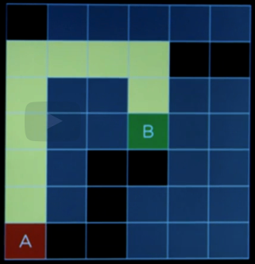

# Notes Introducción

## Terminologia

- Agente (Agent)): Entidad que percibe su entorno
- Estado (State): Alguna configuración del agende en su entorno
- Acciones (Actions): Acciones a realizar para un fin, una acción no necesariamente va a funcionar en diferentes estados

```mathematica
1. actions: "acciones"
2. s: "estado"
actions(s)
```

- modelo de transición (Transition model)): describe el resultado de una acción en algun u otro estado

  ```mathematica
  1. result: "modelo de transición que es el resultado de una acción en determinado estado"
  2. s: "estado"
  3. a: "acción"
  result(s, a)
  ```


- estado del spacio (State space): es el conjunto de todos los posibles estados desde una posición inicial tomando cualquier secuencia de acciones.
- prueba objetivo (Goal test): Es alguna forma de determinar si un estado es un estado objetivo.
- costo de la ruta (path cost): es minizar los tiempos y cantidad de acciones para buscar un estado objetivo
- solución optima (optimal solution): Solo significa que no hubiesemos podido hacerlo mejor en terminos de encontrar esa solución.
- nodo (node): es una estructura de datos que conserva valores para su seguimiento (estado, nodo padre, una acción y el costo de la ruta)
- enfoque (approach): Se empienza con la frontera solo contiene el estado inicial, luego se itera, para esto si la frontera esta vacia, significa que aun no tiene solución

  
- enfoque revisado (revised approach): Se procede de una forma similar, con un estado inicial y limpiar la lista ca da que lo revisamos, luego guardarlo para poder llevar un control sobre las busquedas realizadas.

  
- Pila de datos (Stack): es una estructura de datos donde el ultimo en trar es el primero en salir

### Breadth-first search

Este algoritmo hace una busqueda similar a lo anterior, sin embargo bus explirar el nodo menos profundo de la frontera

Para este algoritmo la busqueda se hace en forma de cola, sonde se respeta el orden de explicación


### DFS (Busqueda en profundidad)



### BFS (Busqueda primero en amplitud), observa los nodos menos profundos, saltando entre ellos


 > 16 se cambia con 15

Ejemplos de utilización de los algoritmos:

Stack


Queue:


