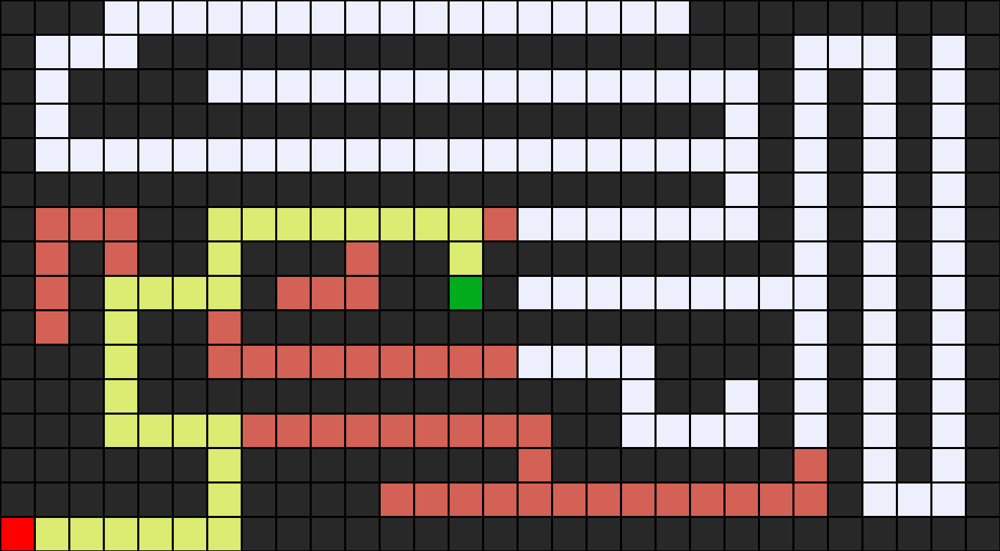
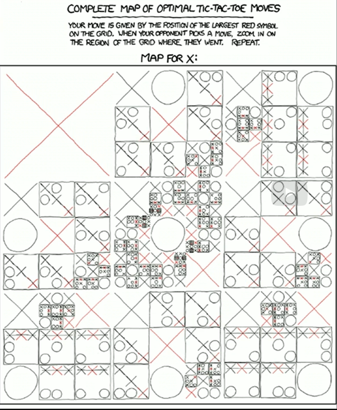

# Notes Introducción

## Terminologia

- Agente (Agent)): Entidad que percibe su entorno
- Estado (State): Alguna configuración del agende en su entorno
- Acciones (Actions): Acciones a realizar para un fin, una acción no necesariamente va a funcionar en diferentes estados

```mathematica
1. actions: "acciones"
2. s: "estado"
actions(s)
```

- modelo de transición (Transition model)): describe el resultado de una acción en algun u otro estado

  ```mathematica
  1. result: "modelo de transición que es el resultado de una acción en determinado estado"
  2. s: "estado"
  3. a: "acción"
  result(s, a)
  ```


- estado del spacio (State space): es el conjunto de todos los posibles estados desde una posición inicial tomando cualquier secuencia de acciones.
- prueba objetivo (Goal test): Es alguna forma de determinar si un estado es un estado objetivo.
- costo de la ruta (path cost): es minizar los tiempos y cantidad de acciones para buscar un estado objetivo
- solución optima (optimal solution): Solo significa que no hubiesemos podido hacerlo mejor en terminos de encontrar esa solución.
- nodo (node): es una estructura de datos que conserva valores para su seguimiento (estado, nodo padre, una acción y el costo de la ruta)
- enfoque (approach): Se empienza con la frontera solo contiene el estado inicial, luego se itera, para esto si la frontera esta vacia, significa que aun no tiene solución

  
- enfoque revisado (revised approach): Se procede de una forma similar, con un estado inicial y limpiar la lista ca da que lo revisamos, luego guardarlo para poder llevar un control sobre las busquedas realizadas.

  
- Pila de datos (Stack): es una estructura de datos donde el ultimo en trar es el primero en salir

### Breadth-first search

Este algoritmo hace una busqueda similar a lo anterior, sin embargo bus explirar el nodo menos profundo de la frontera

Para este algoritmo la busqueda se hace en forma de cola, sonde se respeta el orden de explicación


### DFS (Busqueda en profundidad)


### BFS (Busqueda primero en amplitud), observa los nodos menos profundos, saltando entre ellos


 > 16 se cambia con 15

Ejemplos de utilización de los algoritmos:

Stack


Queue:



## Greedy best-first search (Busqueda codiciona del mejor primero)


Siempre va a expandir  al nodo que cree que está más cerca de la meta


Este algoritmo puede parecer mas optimo, sin embargo dependiendo del escenario puede que no lo sea, por que decidir entre 13 y 11 la desición codiciosa elije 11, siendo este el camino mas largo:


## Algoritmo de busqueda de estrellas


# Algoritmo Minimax

## Busqueda por adversarios

Para realizar un algoritmo que pueda solucionar el juego de 3 en raya (tic tac toe) se debe establecer varios puntos de partida para poder solucionar este problema.


Posiblidad de resultados en los juegos: ganar (1), empagar (0) o perder (-1)

Partiendo de aqui tenemos que el jugador X busca maximar su resultado y el jugador O busca minizar su resultado para ser el vencedor


### Planeación


La evaluación del juego, estamos basando en el algoritmo de minimos y maximo, 


Siempre se buscará tener el valor mas optimo en cada caso que se este jugnado, ademas de ello cada que el juego este mas lejos del termino, el arbol de desición suele ser mas grande.

simplifincando el diagreama


en el siguiente pseudocodigo para simplificar el arboritmo de min-max, se bussca siempre obtener el maximo resultado en el cada caso.


Para poder optimizar esta busqueda de minimos y maximos, se debe de evaluar el mejor puntaje para poder ganar y ademas, si ya encontre un valor bastante bajo, ya no deberia calcular los siguientes, ya que el valor encontrato tiene mejor valor que los demas


Es importante tener claro la cantidad de posibilidades que existe para poder jugar un juego, en el caos de tictac toe son 255168 posibles escenarios


Para poder mejorar el algoritmo minimax, se debe establecer un limite, lo que nos lleva a que el algoritmo no sabe identificar cuando el juego termino, para que deje de evaluar posibles mejores escenarios.

En este caso se utiliza evaluaciones para identificar el estado del juego. Esta evaluación es una estimación, que tan certero es que gane el juego. E la IA este valor es clave para que funcione mejor una IA.

Si bien este valor puede ser mejor agregando variablers al algoritmo, hay juego que ya tinenen predefinido .



## Proyectos y Preguntas

[Tic-Tac-Toe - CS50&#39;s Introduction to Artificial Intelligence with Python (harvard.edu)](https://cs50.harvard.edu/ai/2024/projects/0/tictactoe/)

[Quiz 0 - CS50&#39;s Introduction to Artificial Intelligence with Python (harvard.edu)](https://cs50.harvard.edu/ai/2024/quizzes/0/)
