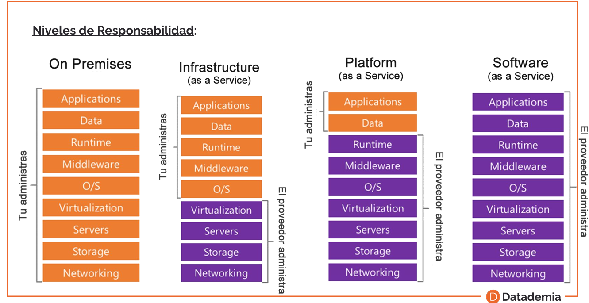
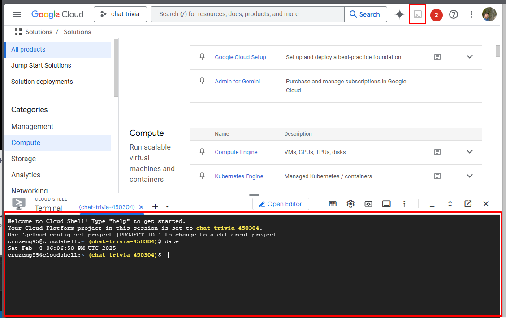
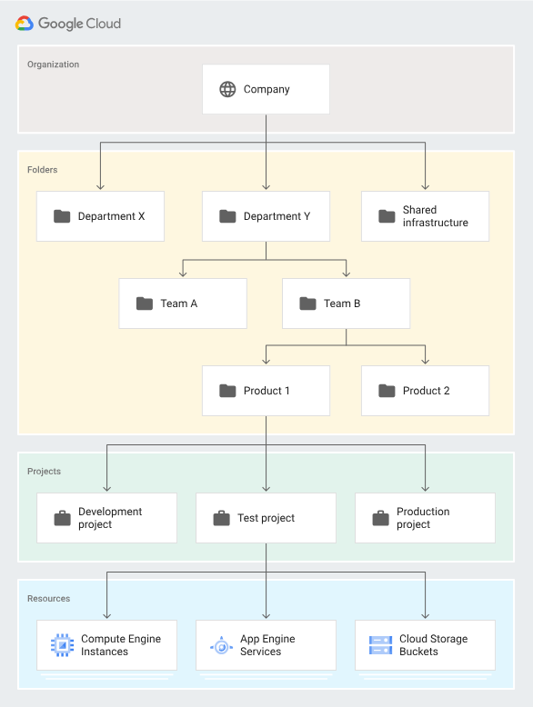

# Deploy GCP

```bash
# Your current project has been set to: [blog-angular-546de].
# 
# Not setting default zone/region (this feature makes it easier to use
# [gcloud compute] by setting an appropriate default value for the
# --zone and --region flag).
# See https://cloud.google.com/compute/docs/gcloud-compute section on how to set
# default compute region and zone manually. If you would like [gcloud init] to be
# able to do this for you the next time you run it, make sure the
# Compute Engine API is enabled for your project on the
# https://console.developers.google.com/apis page.
# 
# Created a default .boto configuration file at [C:\Users\MANUEL\.boto]. See this file and
# [https://cloud.google.com/storage/docs/gsutil/commands/config] for more
# information about configuring Google Cloud Storage.
# The Google Cloud CLI is configured and ready to use!
# 
# * Commands that require authentication will use cruzemg95@gmail.com by default
# * Commands will reference project `blog-angular-546de` by default
# Run `gcloud help config` to learn how to change individual settings
# 
# This gcloud configuration is called [default]. You can create additional configurations if you work with multiple accounts and/or projects.
# Run `gcloud topic configurations` to learn more.
# 
# Some things to try next:
# 
# * Run `gcloud --help` to see the Cloud Platform services you can interact with. And run `gcloud help COMMAND` to get help on any gcloud command.
# * Run `gcloud topic --help` to learn about advanced features of the CLI like arg files and output formatting
# * Run `gcloud cheat-sheet` to see a roster of go-to `gcloud` commands.
```




- capex: gasto de capital, costos fijos
- opex: costos de la operacion, precios que varian acorte al escalado de recursos

## Herramientas

Es una herramienta gratuita con 5GB de procesamiento para poder utilizar y probar los servicios de GCP



## Jerarquia



## Maquinas creadas desde la terminal

`gcloud compute instances create instance-udemy-shell --zone=us-west2-b --machine-type=e2-small --boot-disk-size=10GB`


## Gcloud

```bash

# crear imagen
gcloud builds submit --tag gcr.io/chat-trivia-450304/helloworld

# correr imagen

gcloud run deploy --image gcr.io/chat-trivia-450304/helloworld

```