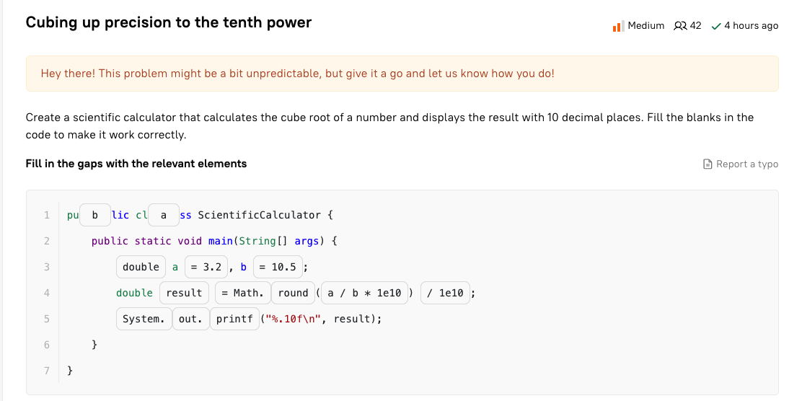
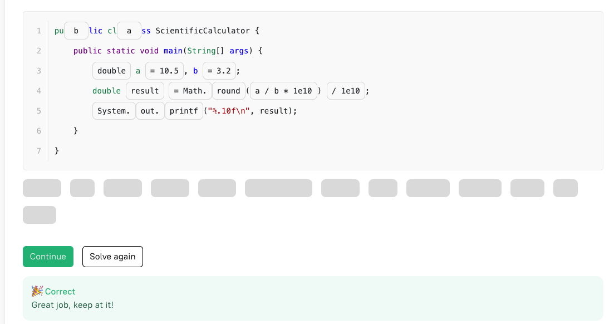

# Java

> Creador: James Gosling
>
> Fecha de lanzamiento: 1995
>
> filosofia: Write Once, Run anywhere (WORA)

###### Hello word example

```java
public class HelloWorld {
    public static void main(String[] args) {
        System.out.println("Hello, World!");
    }
}
```

###### Break

There is another way to stop the outer loop: the labeled break operator. However, it's not good practice to use it. Google it if you are really interested.

Here's an example demonstrating the use of `break` with a label:

```java
outerLoop:
for (int i = 0; i < 10; i++) {
    for (int j = 0; j < 10; j++) {
        System.out.print(j + " ");
        if (i == j) {
            break outerLoop; // Break out of both loops.
        }
    }
    System.out.println();
}
```

###### Switch

1. Switch statement

   ```java
   private enum ThingsToTaste {PIZZA, BROCCOLI, STEAK, SUGAR, DIRT, MEATBALLS, CHOCOLATE}

   int tasteValue = 0;
   ThingsToTaste taste = ThingsToTaste.DIRT;

   switch (taste) {
       case SUGAR:
       case PIZZA:
       case CHOCOLATE:
           tasteValue = 10;
           break;
       case MEATBALLS:
       case STEAK:
           tasteValue = 7;
           break;
       case BROCCOLI:
           tasteValue = 4;
           break;
       case DIRT:
           tasteValue = 1;
           break;
       default:
           throw new IllegalStateException("Invalid tastable object: " + taste);
   }
   System.out.println(taste + ": " + tasteValue);
   ```
2. Switch expresion (Java 12)

   ```java
   int tasteValue = switch (taste) {
       case SUGAR, PIZZA, CHOCOLATE -> 10;
       case MEATBALLS, STEAK -> 7;
       case BROCCOLI -> 4;
       case DIRT -> 1;
       default -> throw new IllegalStateException("Invalid tastable object: " + taste);
   };
   ```
3. Switch expresion with yield (java 13)

   ```java
   int tasteValue = switch (taste) {   
       case SUGAR:   
       case PIZZA:   
       case CHOCOLATE:   
           yield 10;   
       case MEATBALLS:   
       case STEAK:   
           yield 7;  
       case BROCCOLI:  
           yield 4;  
       case DIRT:  
           yield 1;  
       default:  
           throw new IllegalStateException("Invalid tastable object: " + taste);   
   };
   ```

   `yield` no puede ser usado en un switch statement asi como `break` no puede ser usado en switch expresion
   `yield` es una sentencia que reemplaza `break`, busca poder omitir la asignacion de variables y se recomienda utilizando al final para tener codigo mas legible

   - Otros ejemplos de uso (java 13):

   ```java
   tasteValue = switch (taste) {
       case SUGAR, PIZZA, CHOCOLATE -> {
           System.out.println(10);
           yield 10;
       }
       case MEATBALLS, STEAK -> {
           System.out.println(7);
           yield 7;
       }
       case BROCCOLI -> {
           System.out.println(4);
           yield 4;
       }
       case DIRT -> {
           System.out.println(1);
           yield 1;
       }
       default -> {
           throw new IllegalStateException("Invalid tastable object: " + taste);
       }
   };
   ```

###### Reasignación matriz dinamica

Si el tamaño de un arreglo dinámico excede su capacidad, el arreglo se redimensiona mediante la asignación de un nuevo arreglo más grande y la copia de los elementos existentes en él. Esto asegura que el arreglo pueda seguir creciendo a medida que se añaden más elementos.

### Conceptos

* **Class** :
  * **Descripción** : Una clase es un plano o plantilla que define la estructura y comportamiento comunes de un conjunto de objetos.
  * **Ejemplo** : `class Persona { String nombre; int edad; void saludar() { System.out.println("Hola"); } }`
* **Field** :
  * **Descripción** : Un campo es una variable dentro de una clase que almacena el estado de un objeto.
  * **Ejemplo** : En la clase `Persona`, `nombre` y `edad` son campos.
* **Method** :
  * **Descripción** : Un método es una función dentro de una clase que define un comportamiento de los objetos.
  * **Ejemplo** : En la clase `Persona`, `saludar` es un método.
* **Object** :
  * **Descripción** : Un objeto es una instancia de una clase que representa una entidad con estado y comportamiento.
  * **Ejemplo** : `Persona p = new Persona();`
* **Behavior of an object** :
  * **Descripción** : El comportamiento de un objeto se refiere a las acciones que puede realizar, definidas por sus métodos.
  * **Ejemplo** : El método `saludar` define una acción que un objeto de la clase `Persona` puede realizar.
* **Type of an object** :
  * **Descripción** : El tipo de un objeto es la clase a la que pertenece.
  * **Ejemplo** : Si `p` es un objeto creado a partir de la clase `Persona`, entonces `Persona` es el tipo de `p`.
* **State of an object** :
  * **Descripción** : El estado de un objeto se compone de los valores de sus campos en un momento dado.
  * **Ejemplo** : Si `p.nombre = "Juan"` y `p.edad = 30`, entonces el estado del objeto `p` es `nombre = "Juan"` y `edad = 30`.
* **An individual instance of a class** :
  * **Descripción** : Una instancia individual de una clase es un objeto específico creado a partir de esa clase.
  * **Ejemplo** : `Persona p = new Persona();` es una instancia individual de la clase `Persona`.

###### Resumen de lo anterior

- las clases no siempre tienen metodos y campos
- los campos almacenan datos
- los metodos definen el compotamiento de una clase
- los objectos o instancias de una clase interactuan entre si a travez de los metodos
- Una archivo .java puede tener muchas clases, sin embargo solo una puede ser publica y está debe tener el mismo nombre que el archivo.
- los metodos definen las propiedades de una clase
- los metodos se dividen en 2 grupos: estaticos y por instancia
- los metodos estaticos se les puede decir propios de la clase, por que se puede llamar directamente
- los metodos por instancia son propios de un objeto y su ventaja es que pueden acceder a propiedades del objeto.

###### Modificadores

Este es un ejemplo de toma de desición al momento de elegir que modificar utilizar (public, protected, private-package, private)

* **private** — disponible solo dentro de la misma clase;
* **package-private** (tambien conocido por "default", o declaración implicita) — disponible para todas las clases dentro del mismo paquete;
* **protected** — disponible para todas las clases dentro del mismo paquete y subclases (herencia);
* **public** — disponible para todas las clases.


##### Protected vs Default

el nivel de acceso de protected, limita solo en herancia (a clases hijas). Mientras que por defecto puede ser leida por otra clase dentro de un mismo paquete.

Ej: Usted tiene vecinos en un departamento, con algunos puede conversar acerca de acuerdos del uso de sotano, limpieza etc.; este seria de tipo "default". Mientras que con otro grupo de vecinos, podria hacer una parrillada, invitalos a su casa para jugar con sus hijos; este seria de tipo "protected"

## ADT y CDT

La diferencia clave entre un Tipo de Datos Concreto (CDT) y un Tipo de Datos Abstracto (ADT) radica en su nivel de abstracción y los detalles que exponen:

### Tipo de Datos Abstracto (ADT):

* **Nivel de Abstracción** : Los ADT se definen por su comportamiento (las operaciones que soportan) en lugar de su implementación. Se enfocan en **qué** hace el tipo de datos, no en **cómo** se implementa.
* **Ocultación de Implementación** : La implementación interna de un ADT está oculta, lo que permite cambiar la implementación sin afectar a los usuarios del tipo de datos.
* **Ejemplo** : Una lista, pila o cola en términos abstractos, donde se conocen las operaciones como agregar, eliminar, pero no se especifica cómo se almacenan o manejan los datos internamente.

### Tipo de Datos Concreto (CDT):

* **Nivel de Abstracción** : Los CDT, en cambio, se definen tanto por su comportamiento como por su implementación específica. Se enfocan en **cómo** se implementan los datos y las operaciones.
* **Exposición de Implementación** : En un CDT, la implementación es visible y directa. El diseño y la estructura de los datos son parte esencial de su definición.
* **Ejemplo** : Un array o una lista enlazada específica, donde se conoce tanto la estructura interna (por ejemplo, un array de elementos o nodos enlazados) como las operaciones.

En resumen, los ADT describen la interfaz y comportamiento sin detallar la implementación, mientras que los CDT incluyen tanto la estructura interna como la funcionalidad en su definición.

#### Herencia

* Java doesn't support multiple-class inheritance, meaning that a class can only inherit from a single superclass;
* a class hierarchy can have multiple levels (class `C` can extend class `B` that extends class `A`);
* a superclass can have more than one subclass.

##### Floar y Double

* float admite entre 6 y 7 decimales
* double admite entre 14 y 16 decimales

###### Errores de la computación:

Por que ocurre? por que no es posible almacenar valores reales en un sistema binario de forma exacta.

1. Errores de calculo:

   ```java
   System.out.println(3.3 / **3**); **// prints 1.0999999999999999**

   // 3.3 * 4.5 = 7.425
   // 2.2 * 4.01 = 4.4110000000000005
   ```
2. Erropres que se acumulan durante el calculo

   ```java
   double d = 0.1 + 0.1 + 0.1 + 0.1 + 0.1 + 0.1 + 0.1 + 0.1 + 0.1 + 0.1;
   System.out.println(d); // it prints 0.9999999999999999
   ```
3. Ref: [Floating Point (princeton.edu)](https://introcs.cs.princeton.edu/java/91float/)
4. Importante:

   Al momento de scaner un valor, puede dar conflictos en el formato. No reconocer el punto y reconocer la coma. Para evitar eso, asegure que la configuración este en ingles.

   ```java
   Scanner scanner = new Scanner(System.in).useLocale(Locale.US);
   ```

##### Herencia (Subclases)

1. **Subclass reference**: Creamos instancias utilizando las subclases, la variable tienen el mismo tipo de clase que la creación de instancia

```java
Person person = new Person(); // the reference is Person, the object is Person
Client client = new Client(); // the reference is Client, the object is Client
Employee employee = new Employee(); // the reference is Employee, the object is Employee
```

In this case, we used** subclass references** because the types of the references and the created object are the same.

2. **Superclass reference:** Cuando instancias utilizando la superclase, la variable tiene el tipo de dato de la superclase y se diferencia de la creación de instancia

```java
Person client = new Client(); // the reference is Person, the object is Client
Person employee = new Employee(); // the reference is Person, the object is Employee
```

# Revisar !





## Methods provided by the Object class

The `Object` class provides some common methods to all subclasses. It has nine [instance methods](https://hyperskill.org/learn/step/3596 "In Java, an instance method is a method that belongs to each object created of a particular class. | It can access fields of the specific object of the class. For example, if we have a class with two instance methods: method1() and method2(), and two objects: object1 and object2, the output of these methods will be different for each object because they have different values for the fields. To use an instance method, you must first create an object.") (excluding overloaded methods) which can be divided into four groups:

* **thread synchronization:** `wait`, `notify`, `notifyAll`;
* **object identity** : `hashCode`, `equals`;
* **object management** : `finalize`*, *`clone`*, *`getClass`*;*
* **human-readable representation** : `toString`;

Some of the methods listed above are native, which means they are implemented using **native** code. It is typically written in C or C++.

##### Metodos y variables estaticos

Un metodo estatico es propio de la clase, y no puede ser invocar.  Aqui un ejemplo.

```java
public class SomeClass {
  
    public SomeClass() {
        invokeAnInstanceMethod(); // this is possible here
        invokeAStaticMethod();    // this is possible here too
    }
  
    public static void invokeAStaticMethod() { 
        // it's impossible to invoke invokeAnInstanceMethod() here
    }
  
    public void invokeAnInstanceMethod() { 
        invokeAStaticMethod();  // this is possible
    }
}
```

## `@Deprecated` annotation

Desde java 9 se introdujo parametros a la anotación @Deprecated:  `since` y `forRemoval`. We will quickly break them down because there is a big chance you will meet them in practice.

* `since` requires the version (String) in which the annotated element has become deprecated. The default value is an empty string.
* `forRemoval` indicates whether the annotated element is to be removed in a future version. The default value is `false`.

```java
@Deprecated(since = "5.3", forRemoval = true)
public void printHello() {
    System.out.println("Hello!");
}
```

### @Overriding

Se puede sobre escribir un metodo, y asi obtener un comportamiento espial al metodo heredado. Debe cumplir los siguientes requicitos:

- El nombre del metodo y variables debe ser el mismo
- La cantidad, tipo de dato y orden de los parametros debe ser el mismo
- El valor debe ser el mismo al hererado
- Se puede cambiar el nivel de acceso, siempre y cuando sea mayor
- No se puede sobreescribir metodos estaticos
- Si se agrega la palabra clave "final", no permite sobreescribir

Las anotaciones no son obligatorias, son una conveniencia

### Polimorfismo

Es el hecho transformar un objeto o metodo con una nueva forma. Existen de 2 tipos, estaticos (compile-time) y dinamicos (runtime).

**Ad-hoc polymorphism**: Es la sobrecarga de metodos basandose en parametros

**[Subtype polymorphism](https://hyperskill.org/learn/step/3587):** Es cuando podemos utilizar una subclase, pero en su lugar usamos la instancia de la clase base.

**Parametric polymorphism**: Es cuando se utiliza un parametro sin especificar o de tipo generico.

**Ejemplo de polimorfismo por subtype**

```java
class MythicalAnimal {  

    public void hello() {
        System.out.println("Hello, I'm an unknown animal");
    }
}

class Chimera extends MythicalAnimal {
    @Override
    public void hello() {
        System.out.println("Hello! Hello!");
    }
}

class Dragon extends MythicalAnimal {
    @Override
    public void hello() {
        System.out.println("Rrrr...");
    }
}
```

```java
MythicalAnimal chimera = new Chimera();
MythicalAnimal dragon = new Dragon();
MythicalAnimal animal = new MythicalAnimal();
```

```java
chimera.hello(); // Hello! Hello!
dragon.hello(); // Rrrr...
animal.hello(); // Hello, I'm an unknown animal
```

**Ejemplo de polimorfismo runtime**

Este permine modificar un metodo de la clase base, y sin que la subclase modifique un metodo de la clase padre y este ejecute el metodo de la clase hijo.

```java
class File {

    protected String fullName;

    // constructor with a single parameter

    // getters and setters

    public void printFileInfo() {
        String info = this.getFileInfo(); // here is polymorphic behavior!!!
        System.out.println(info);
    }

    protected String getFileInfo() {
        return "File: " + fullName;
    }
}

class ImageFile extends File {

    protected int width;
    protected int height;
    protected byte[] content;

    // constructor

    // getters and setters

    @Override
    protected String getFileInfo() {
        return String.format("Image: %s, width: %d, height: %d", fullName, width, height); 
    }
}
```

```java
File img = new ImageFile("/path/to/file/img.png", 480, 640, someBytes); // assigning an object
```

```java
img.printFileInfo(); // It prints "Image: /path/to/file/img.png, width: 480, height: 640"
```

**Ejercicio complejo de herencia y polimorfismo**

```java
class Test {

    public static void main(String[] args) {
        new TeamLead(1);
	// Expected:
	// 1 programmer
	// 1 teamlead
    }

    public static class TeamLead extends Programmer {

        private final int numTeamLead;

        public TeamLead(int numTeamLead) {
            super(numTeamLead);
            this.numTeamLead = numTeamLead;
            employ();
        }

        protected void employ() {
            System.out.println(numTeamLead + " teamlead");
        }

    }

    public static class Programmer {

        private final int numProgrammer;

        public Programmer(int numProgrammer) {
            this.numProgrammer = numProgrammer;
            employ();
        }

        protected void employ() { // OK, change protected -> private
            System.out.println(numProgrammer + " programmer");
        }
    }
}

```

### Interfaces

Es la defición que puede tener cierto comportamiento de una clase, por ejemplo: El lapiz, pincel, lapicero, todos comparten caracteristicas similares, sin embargo todos sirven para dibujar.

```java
interface DrawingTool {
    void draw(Curve curve);
}
class Pencil implements DrawingTool {
    ...
    public void draw(Curve curve) {...}
}

class Brush implements DrawingTool {
    ...
    public void draw(Curve curve) {...}
}
```

Las interfaces pueden considerarse un tipo especial de clase que no se puede instanciar. Estas pueden contener:

- constantes publicas
- metodos abstractos sin implementar
- metodos por defecto con implementación
- metodos estaticos con implementación

```java
interface Interface {
  
    int INT_CONSTANT = 0; // it's a constant, the same as public static final int INT_CONSTANT = 0
  
    void instanceMethod1();
  
    void instanceMethod2();
  
    static void staticMethod() {
        System.out.println("Interface: static method");
    }
  
    default void defaultMethod() {
        System.out.println("Interface: default method");
    }

    private void privateMethod() {
        System.out.println("Interface: private method");
    }
}
```

### Random

Los numeros random, son aquellos que se consideran casi impredesibles. Por detras no son realmente impredesibles, por que se basan en un valor inicial y un algoritmo.

##### Consideraciones

Generalmente la clase Random no puede hacer ciertas cosas, por ejemplo si quisiera obtener numeros random entre 2 y 5, no existe una funcion para devolver estos valores. Debido a que el valor aleatorio empieza en 0 y se va hasta el valor inicial ingresado por parametro.


Para poder implementar esta funcion, donde incluye los extremos (2 y 5), podemos hacer una funcion, donde tomemos el valor final, menos el valor inicial para obtener el rango a iterar luego sumar uno. Con esto obtendremos numeros aleatorios en el rango especificado. Sin embargo nos falta igualar los resultados al rango esperado, Para ellos se recomienda sumar el valor minimoi:

```java
int next = random.nextInt(upper - lower + 1) + lower;
```

De esta forma obtendremos un aleatorio en el rango necesario e igualamos el resultado al rango de numeros que nos interesa.
